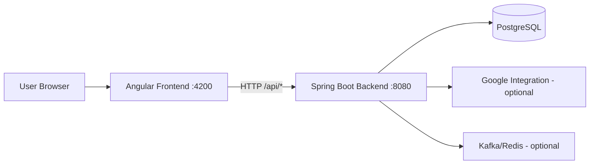

# Build Plan and System Architecture

## 1. Purpose
This document provides a clean, practical reference for:
- how to build and run the current system,
- what is implemented today,
- what is optional or planned next.

Scope in this repository:
- Backend: Spring Boot modular monolith in `backend/`
- Frontend: Angular app in `frontend/`
- Optional future microservices definitions in `microservices/`

## 2. Current System Snapshot

### 2.1 Runtime Baseline
- Java: 17 (from `backend/pom.xml`)
- Maven: 3.9+
- Node.js: 20 LTS
- npm: 10+
- Angular: 18 (`frontend/package.json`)
- Backend port: `8080` (`backend/src/main/resources/application.yml`)
- Frontend port: `4200` (`frontend/package.json`)

### 2.2 High-Level Architecture (Current)



### 2.3 Backend Structure (Current)
Base package: `com.pointer.management`

Implemented/scaffolded areas:
- `bootstrap`: app entrypoint (`ManagementApplication`)
- `config`: app/web config (including CORS)
- `features`: business modules (`minutes`, `event`, `analytics`, `auth`, `user`)
- `infrastructure`: external adapters (`ai`, `kafka`, `config`)
- `core` and `shared`: shared domain/security/util patterns

### 2.4 Frontend Structure (Current)
- Root app shell: `frontend/src/app/app.component.*`
- API client: `frontend/src/app/core/api/api.service.ts`
- Feature folders: `frontend/src/app/features/dashboard`, `minutes`, `rag`, `integrations`

## 3. Build and Run Plan

### 3.1 Prerequisite Check
Run before first build:

```bash
java -version
mvn -version
node -v
npm -v
```

### 3.2 Local Development
Backend:

```bash
cd backend
mvn clean test
mvn spring-boot:run
```

Frontend (new terminal):

```bash
cd frontend
npm install
npm run build
npm start
```

Expected:
- Backend: `http://localhost:8080`
- Frontend: `http://localhost:4200`

### 3.3 Smoke Test
- Open frontend and verify API-backed screens load.
- Confirm frontend-to-backend calls under `/api/**` succeed.

## 4. Packaging and CI

### 4.1 Release Packaging
Backend:

```bash
cd backend
mvn clean package -DskipTests
```

Frontend:

```bash
cd frontend
npm ci
npm run build
```

Artifacts:
- Backend JAR: `backend/target/*.jar`
- Frontend bundle: `frontend/dist/`

### 4.2 Minimal CI Stages
1. Backend verify: `mvn -f backend/pom.xml clean verify`
2. Frontend verify: `npm ci --prefix frontend` and `npm run build --prefix frontend`
3. Optional frontend test: `npm test --prefix frontend -- --watch=false --browsers=ChromeHeadless`
4. Publish artifacts only when all required stages pass

## 5. Configuration Notes

### 5.1 Profiles
Backend profile files:
- `backend/src/main/resources/application.yml`
- `backend/src/main/resources/application-dev.yml`
- `backend/src/main/resources/application-prod.yml`
- `backend/src/main/resources/application-microservices.yml`

### 5.2 Common Environment Variables
- Database connection settings
- Google integration settings (if enabled)
- Kafka/Redis settings (if enabled)
- Security/JWT settings (if enabled)

Keep optional integrations feature-flagged or profile-gated for local builds.

## 6. What Is Optional vs. In Scope Today

In scope now:
- Backend + frontend local build and run
- Core REST API flows and Angular client integration
- PostgreSQL + Flyway baseline

Optional or planned:
- Kafka and Redis operational wiring
- Deeper analytics and notification pipelines
- Full microservices extraction

## 7. Microservices Direction (Condensed)
The `microservices/` folder outlines a scale-out target (`api-gateway`, `identity-service`, `event-service`, `minutes-service`, `planning-service`, `integration-service`, `notification-service`, `analytics-service`).

Use this as a roadmap, not as required build/runtime context for the current modular monolith.

## 8. Known Cleanup Item
- Java version references are inconsistent across docs (some mention 21, build config uses 17). Standardize this in all docs and CI/runtime images.
